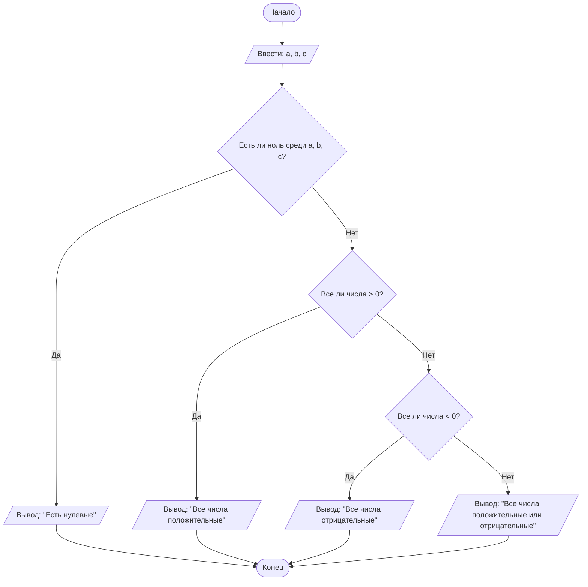

## Отчет по лабораторной работе № 1

#### № группы: `ПМ-2602`

#### Выполнил: `Белясник Варвара Владимировна`

#### Вариант: `2`

### Cодержание:

- [Постановка задачи](#1-постановка-задачи)
- [Входные и выходные данные](#2-входные-и-выходные-данные)
- [Выбор структуры данных](#3-выбор-структуры-данных)
- [Алгоритм](#4-алгоритм)
- [Программа](#5-программа)
- [Анализ правильности решения](#6-анализ-правильности-решения)

### 1. Постановка задачи

- Условия задачи

> На вход программы подаются три целых числа A, B, C. Необходимо вывести одно из следующих сообщений в зависимости от значений чисел:
> - «Все числа положительные», если все три числа больше нуля.
> - «Все числа отрицательные», если все три числа меньше нуля.
>- «Все числа положительные или отрицательные», если среди чисел
есть как положительные, так и отрицательные.
>- «Есть нулевые», если хотя бы одно из чисел равно нулю.

Задачу можно разделить на проверку четырёх взаимоисключающих случаев. Поскольку условие наличия нуля имеет приоритет (нуль не является ни положительным, ни отрицательным числом), проверять его нужно первым. После этого остаются три варианта: 
- все числа положительные
- все отрицательные
- среди них есть как положительные, так и отрицательные.

Порядок проверки:

1. Хотя бы одно число равно нулю -> «Есть нулевые»
2. Все три числа > 0 -> «Все числа положительные»
3. Все три числа < 0 -> «Все числа отрицательные»
4. Иначе (есть и положительные, и отрицательные) -> «Все числа положительные или отрицательные»

### 2. Входные и выходные данные

#### Данные на вход

На вход программа должна принимать три целых числа A, B, C.

|             | Тип         | min значение    | max значение       |
|-------------|-------------|-----------------|--------------------|
| A (Число 1) | Целое число | -2<sup>63</sup> | 2<sup>63</sup> - 1 |
| B (Число 2) | Целое число | -2<sup>63</sup> | 2<sup>63</sup> - 1 |
| C (Число 3) | Целое число | -2<sup>63</sup> | 2<sup>63</sup> - 1 |


#### Данные на выход

Программа должна выводить одно из следующих сообщений:
- «Все числа положительные»
- «Все числа отрицательные»
- «Все числа положительные или отрицательные»
- «Есть нулевые»

### 3. Выбор структуры данных

Программа получает 3 целых числа, не превышающих по модулю 2<sup>63</sup> - 1. Поэтому для их хранения можно выделить 3 переменных (`a`, `b` и `c`) типа `long`. Входные числа хранятся в переменных типа long, т. к. этот тип обладает более широким диапазоном значений, чем int, что оправдано отсутствием в условии ограничений на величину чисел.

|             | название переменной | Тип (в Java) | 
|-------------|---------------------|--------------|
| A (Число 1) | `a`                 | `long`       |
| B (Число 2) | `b`                 | `long`       | 
| C (Число 3) | `c`                 | `long`       |

### 4. Алгоритм

#### Алгоритм выполнения программы:
1. **Ввод данных:**  Программа считывает три целых числа a, b и c из стандартного ввода.
2. **Проверка условий по приоритету:**
   - Если хотя бы одно из чисел равно 0, вывести «Есть нулевые» и завершить проверку (остальные условия не нужны).
   - Иначе если a > 0 и b > 0 и c > 0, вывести «Все числа положительные».
   - Иначе если a < 0 и b < 0 и c < 0, вывести «Все числа отрицательные».
   - Иначе если ни одно из предыдущих условий не выполнилось, значит, среди чисел есть и положительные, и отрицательные. Вывести «Все числа положительные или отрицательные».
3. **Вывод результата:**
   Сообщение выводится на консоль.

#### Блок-схема



### 5. Программа

```java
import java.io.PrintStream;
import java.util.Scanner;

public class Main {
    // Объявляем объект класса Scanner для ввода данных
    public static Scanner in = new Scanner(System.in);
    // Объявляем объект класса PrintStream для вывода данных
    public static PrintStream out = System.out;

    public static void main(String[] args) {
        // Считывание трёх целых чисел a, b и c из консоли
        long a = in.nextLong();
        long b = in.nextLong();
        long c = in.nextLong();

        // Сначала проверяем наличие нулей — это приоритетное условие
        if (a == 0 || b == 0 || c == 0) {
            out.println("Есть нулевые");
        }
        // Все числа строго больше нуля
        else if (a > 0 && b > 0 && c > 0) {
            out.println("Все числа положительные");
        }
        // Все числа строго меньше нуля
        else if (a < 0 && b < 0 && c < 0) {
            out.println("Все числа отрицательные");
        }
        // Нулей нет, но знаки разные
        else {
            out.println("Все числа положительные или отрицательные");
        }
    }
}
```

### 6. Анализ правильности решения
Программа корректно обрабатывает все возможные комбинации знаков трёх целых чисел.

1. Тест на "все числа положительные":

    - **Input**:
        ```
        5 10 3
        ```

    - **Output**:
        ```
        Все числа положительные
        ```

2. Тест на "все числа отрицательные":

    - **Input**:
        ```
        -4 -2 -12
        ```

    - **Output**:
        ```
        Все числа отрицательные
        ```

3. Тест на "есть нулевые" на разных позициях:

    - **Input**:
        ```
        0 -5 -3
        ```

    - **Output**:
        ```
        Есть нулевые
        ```
    - **Input**:
        ```
        -5 0 3
        ```

    - **Output**:
        ```
        Есть нулевые
        ```
    - **Input**:
        ```
        5 3 0
        ```

    - **Output**:
        ```
        Есть нулевые
        ```

4. Тест на "все числа положительные или отрицательные":

    - **Input**:
        ```
        5 3 -16
        ```

    - **Output**:
        ```
        Все числа положительные или отрицательные
        ```
    - **Input**:
        ```
        5 -3 16
        ```

    - **Output**:
        ```
        Все числа положительные или отрицательные
        ```
    - **Input**:
        ```
        -5 3 16
        ```

    - **Output**:
        ```
        Все числа положительные или отрицательные
        ```
    - **Input**:
        ```
        5 -3 -16
        ```

    - **Output**:
        ```
        Все числа положительные или отрицательные
        ```
    - **Input**:
        ```
        -5 -3 16
        ```

    - **Output**:
        ```
        Все числа положительные или отрицательные
        ```
    - **Input**:
        ```
        -5 3 -16
        ```

    - **Output**:
        ```
        Все числа положительные или отрицательные
        ```
5. Тест на граничные значения long:
    - **Input**:
        ```
        -9223372036854775808 9223372036854775807 -1
        ```

    - **Output**:
        ```
        Все числа положительные или отрицательные
        ```
